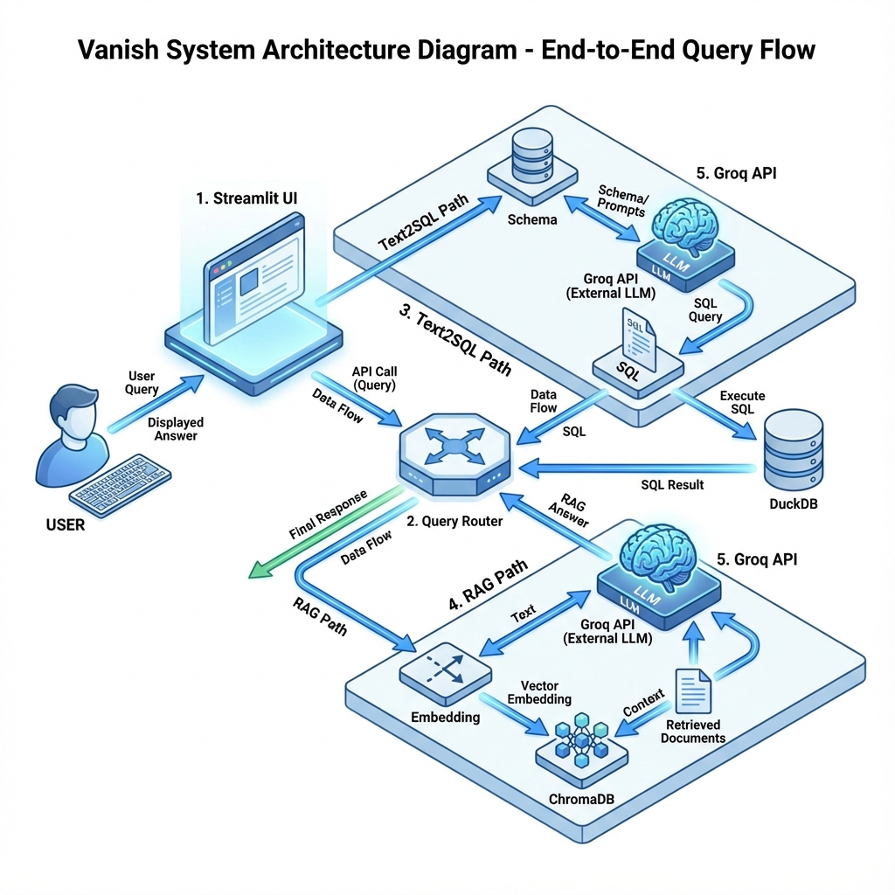
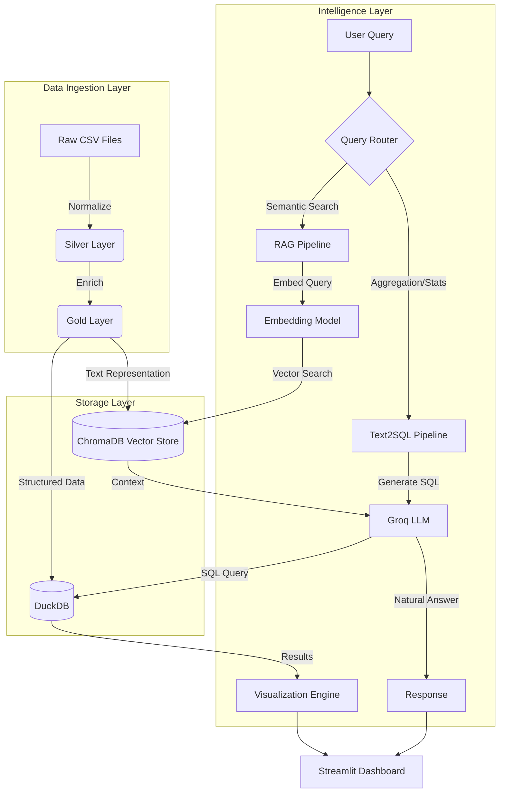
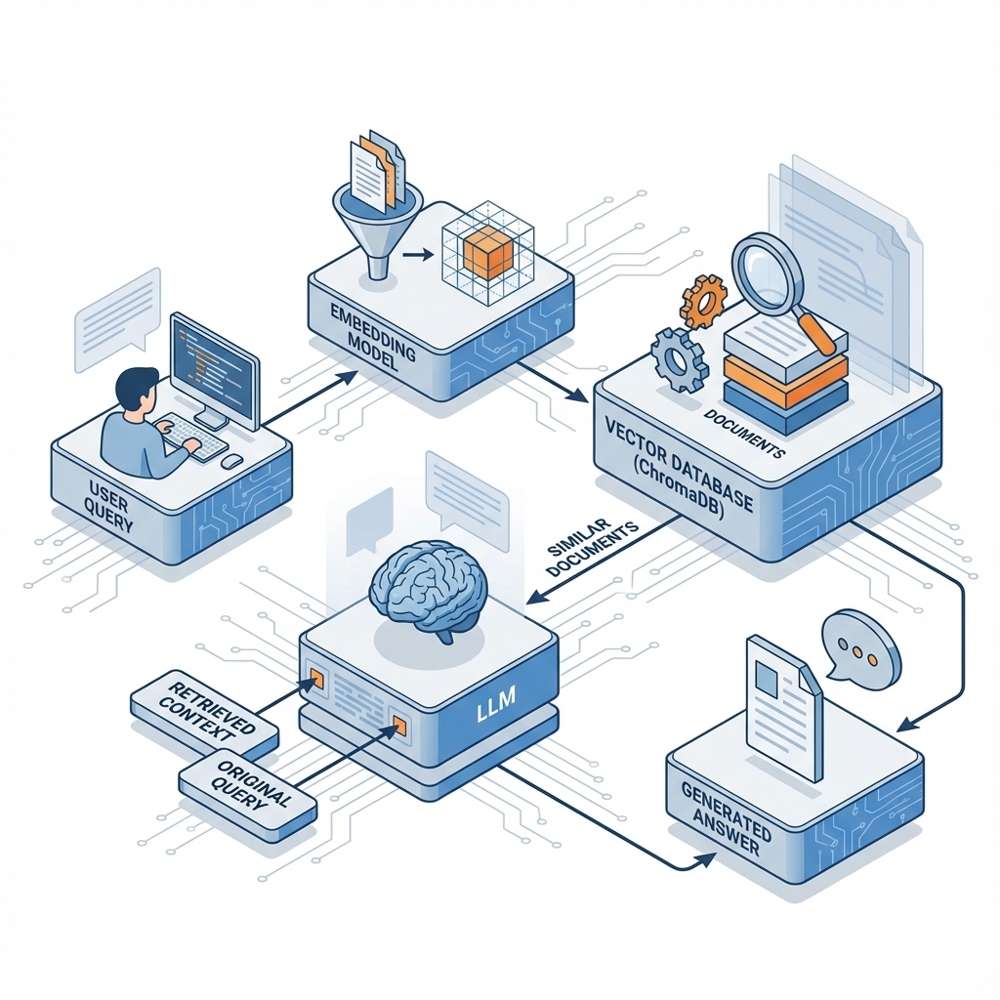

<div align="center">
  

  # ✨ Vanish: Talk to Your Data
  
  [](https://www.python.org/)
  [](https://streamlit.io/)
  [](https://duckdb.org/)
  [](https://www.trychroma.com/)
  [](https://groq.com/)

  **Turn your insurance claims data into actionable insights using Natural Language.**
  
  [Features](#-features) • [Architecture](#-architecture) • [Installation](#-installation) • [Usage](#-usage)

</div>

---

## 🚀 Overview

**Vanish** is a powerful AI-driven analytics platform that bridges the gap between raw data and human understanding. By leveraging **Large Language Models (LLMs)** via Groq, **Vector Search (RAG)**, and **Text-to-SQL** capabilities, Vanish allows users to query complex insurance claims datasets as if they were talking to a colleague.

Whether you need to find specific denied claims for a diagnosis or aggregate millions of dollars in payouts, Vanish understands your intent and fetches the answer instantly.

---

## 🏗 Architecture

Vanish employs a dual-pipeline architecture to handle both structured aggregation and semantic search.

<div align="center">
  
</div>

### System Flow
The system processes data through a robust **ETL (Extract, Transform, Load)** pipeline before making it available for querying. The diagram above illustrates the complete transaction flow from user query to API calls and response generation.



---

## ✨ Features

### 🧠 1. Text-to-SQL Pipeline
*For precise numbers, aggregations, and filtering.*
- Converts natural language (e.g., *"Show me total claims for Diabetes in 2023"*) into executable **DuckDB SQL**.
- Handles complex logic like case insensitivity, synonyms (Approved/Paid), and date filtering.
- **Self-Correction**: Automatically detects SQL errors and provides feedback.

### 🔍 2. RAG (Retrieval Augmented Generation) Pipeline
*For context, reasoning, and semantic understanding.*

<div align="center">
  
</div>

- Indexes claims as text documents using **ChromaDB**.
- Retrieves relevant claims based on meaning, not just keywords.
- Generates human-like explanations for *why* a claim might have been denied.

### 📊 3. Interactive Visualizations
- Automatically generates charts (Bar, Line, Pie) based on the data returned.
- seamless integration with Streamlit for a responsive UI.

### 🔄 4. Robust ETL
- **Bronze -> Silver -> Gold** architecture.
- Normalizes disparate data sources (different column names, formats) into a unified schema.

---

## 🛠 Installation

1. **Clone the Repository**
   ```bash
   git clone https://github.com/yourusername/vanish.git
   cd vanish
   ```

2. **Create a Virtual Environment**
   ```bash
   python -m venv .venv
   source .venv/bin/activate  # On Windows: .venv\Scripts\activate
   ```

3. **Install Dependencies**
   ```bash
   pip install -r requirements.txt
   ```

4. **Set Up Environment Variables**
   Create a `.env` file in the root directory:
   ```env
   GROQ_API_KEY=your_groq_api_key_here
   ```

---

## 🖥 Usage

1. **Run the Application**
   ```bash
   streamlit run app.py
   ```

2. **Load Data**
   - Use the sidebar to upload your CSV files or use the sample data.
   - Click **"Process Data"** to run the ETL pipeline.

3. **Ask Questions!**
   - Select **Text2SQL** for questions like: *"How many claims were denied?"*
   - Select **RAG** for questions like: *"Why was patient John Doe's claim rejected?"*

---

## 📦 Tech Stack

| Component | Technology | Description |
|-----------|------------|-------------|
| **Frontend** | Streamlit | Interactive web interface |
| **LLM** | Groq (Llama 3) | High-speed inference for SQL & Chat |
| **Database** | DuckDB | High-performance analytical SQL engine |
| **Vector DB** | ChromaDB | Embedding storage for semantic search |
| **Embeddings** | SentenceTransformers | `all-MiniLM-L6-v2` for text encoding |
| **Data Proc** | Pandas | Data manipulation and ETL |

---

<div align="center">
  <sub>Built with ❤️ by the Vanish Team</sub>
</div>
